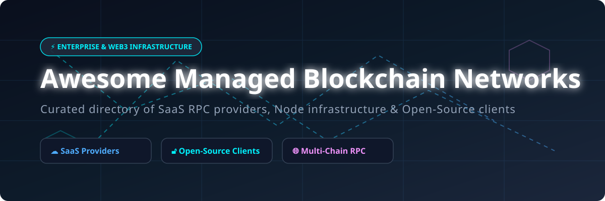

  

# 🌐 Awesome Managed Blockchain Networks & Node Infrastructure 🚀

  
  
  
  
  

## 📌 Top Managed Blockchain Networks Ecosystem & Infrastructure Guide

> **Curated List of Enterprise SaaS Node Providers, Multi-Chain RPC Infrastructure & Open-Source Blockchain Clients**  
> *Focused on Managed Blockchain Nodes, Web3 RPC Endpoints, Staking Automation & Self-Hosted Validator Platforms*  
> **Last updated: October 2026** 📅

---

## 📖 Overview & SEO Summary

This repository tracks notable **commercial managed blockchain platforms** and **open-source projects** that provision, operate, and scale blockchain nodes, RPC endpoints, validator infrastructure, and private networks — ranging from fully managed Web3 RPC providers to high-throughput self-hosted node clients and Blockchain-as-a-Service (BaaS) platforms.

* **SaaS Category Leaders:** Amazon Managed Blockchain, Alchemy, Infura, QuickNode, Blockdaemon, Moralis, Tatum, Ankr, Kaleido, Chainstack.
* **Open-Source Foundations:** Bitcoin Core, Geth (go-ethereum), Solana Validator, Substrate, Chainlink, LND, Cosmos SDK, Reth, Erigon, Prysm, Lighthouse, Hyperledger Besu, and Firedancer.

---

## 📚 Table of Contents

- [☁️ Managed SaaS & Hosted Platforms](#️-managed-saas--hosted-platforms)
  - [Market Overview & Ecosystem Dynamics](#market-overview--ecosystem-dynamics)
  - [SaaS Provider Matrix & Valuation Ranking](#saas-provider-matrix--valuation-ranking)
- [🔓 Open-Source GitHub Projects](#-open-source-github-projects)
- [🤝 How to Contribute](#-how-to-contribute)
- [📊 Star History](#-star-history)
- [💖 Support & Sponsorship](#-support--sponsorship)
- [⚠️ Disclaimer](#️-disclaimer)

---

## ☁️ Managed SaaS & Hosted Platforms

### Market Overview & Ecosystem Dynamics

> 💡 **Market Size & Structure:**  
> The global **Managed Blockchain & Web3 RPC Infrastructure Market** is estimated at **$3.8 Billion (2026)** and is projected to reach **$18.5 Billion by 2030** (CAGR ~48.5%). The market is **moderately fragmented**: hyper-scale cloud giants (AWS, Blockdaemon) dominate institutional enterprise deployments, while specialized RPC infrastructure leaders (Alchemy, Infura, QuickNode) capture developer mindshare across EVM and Solana ecosystems.

### SaaS Provider Matrix & Valuation Ranking

| SaaS Platform 🏢 | Estimated Valuation / Funding / Size 📈 | Starter Paid Tier Pricing 💳 | Permanent Free Tier / Free Trial Limits 🎁 | Key Strengths & Use Cases 🎯 |
| :--- | :--- | :--- | :--- | :--- |
| **[Amazon Managed Blockchain](https://aws.amazon.com/managed-blockchain/)** | **$1.8+ Trillion** (AWS Parent Market Cap) | Pay-as-you-go ($0.067/hr per peer node + storage) | 2-month Free Tier (750 hrs/mo peer node + 20 GB storage) | Fully managed Hyperledger Fabric & Ethereum nodes integrated with AWS IAM. |
| **[Alchemy](https://www.alchemy.com/)** | **$10.2 Billion** (Valuation) | Growth Plan ($49/month for 30M CUs) | Permanent Free Tier (300 Million Compute Units/mo + 300 req/sec) | Leading Web3 development platform with enhanced APIs, Notify, and debugging tools. |
| **[Blockdaemon](https://www.blockdaemon.com/)** | **$3.25 Billion** (Valuation) | Starter Plan ($99/month for shared node) | Permanent Free Tier (100,000 requests/day across shared RPC endpoints) | Enterprise-grade institutional node management, validator staking, and security compliance. |
| **[Infura](https://www.infura.io/)** | **$7.0 Billion** (Consensys Valuation) | Developer Plan ($50/month for 3M req/day) | Permanent Free Tier (3,000,000 requests/day + 100K IPFS requests) | Trusted Ethereum RPC provider by Consensys; default RPC backend for MetaMask wallet. |
| **[QuickNode](https://www.quicknode.com/)** | **$800 Million** (Valuation) | Discover Plan ($49/month for 20M API Credits) | Permanent Free Tier (10,000,000 API Credits/mo + 50 req/sec) | High-performance multi-chain RPC infrastructure supporting 80+ networks with Streams. |
| **[Moralis](https://moralis.io/)** | **$150 Million+** (Estimated Valuation) | Pro Plan ($49/month for 10M CUs) | Permanent Free Tier (40,000 Compute Units/day + 1,000 req/min) | Web3 structured data APIs, indexing across 40+ EVM chains, Solana & AI agent skills. |
| **[Ankr](https://www.ankr.com/)** | **$300 Million** (Token Market Cap / FDV) | Premium Plan ($35/month pay-as-you-go API credits) | Permanent Free Tier (30,000,000 API Credits/mo + unlimited public endpoints) | Decentralized Web3 infrastructure powered by DePIN node network. |
| **[Chainstack](https://chainstack.com/)** | **$100 Million+** (Estimated Funding/Valuation) | Growth Plan ($49/month includes 20M requests) | Permanent Free Tier (3,000,000 requests/mo + 2 elastic nodes) | Multi-chain infrastructure with Hybrid Cloud for running nodes inside user cloud VPC. |
| **[Tatum](https://tatum.io/)** | **$80 Million** (Estimated Funding/Valuation) | Start Plan ($49/month for 20M CUs) | Permanent Free Tier (200,000 requests/day + 5 req/sec limit) | Enterprise blockchain infrastructure SDK, unified data API, SOC2 & ISO 27001 certified. |
| **[Kaleido](https://www.kaleido.io/)** | **$50 Million** (Estimated Enterprise Valuation) | Basic Enterprise ($260/month per environment) | 14-day Free Trial (Full platform access with 2 test nodes) | Enterprise blockchain business cloud for private permissioned networks & consortiums. |

---

## 🔓 Open-Source GitHub Projects

Below is a comprehensive list of open-source execution clients, consensus layers, validator software, oracle frameworks, and deployment automation tools sorted by **GitHub Star Count (Descending)**.

| Project & Repo 📦 | Tech Stack / License 🛠️ | Description & Use Case 🎯 |
| :--- | :--- | :--- |
| **[Bitcoin Core](https://github.com/bitcoin/bitcoin)**  | `C++ / MIT` | Reference implementation of Bitcoin full node with built-in validation & RPC engine. |
| **[Geth (go-ethereum)](https://github.com/ethereum/go-ethereum)**  | `Go / LGPL-3.0` | Official Go implementation of the Ethereum protocol execution client securing Ethereum mainnet. |
| **[Solana Validator](https://github.com/solana-labs/solana)**  | `Rust / Apache-2.0` | Official reference validator & client software for high-throughput Solana blockchain cluster. |
| **[Substrate](https://github.com/paritytech/substrate)**  | `Rust / GPL-3.0` | Modular Rust framework for building custom sovereign blockchains & Polkadot parachains. |
| **[Chainlink](https://github.com/smartcontractkit/chainlink)**  | `Go / MIT` | Decentralized oracle network connecting smart contracts to real-world data & off-chain APIs. |
| **[LND (Lightning Network)](https://github.com/lightningnetwork/lnd)**  | `Go / MIT` | Complete Lightning Network node implementation for scalable Bitcoin payment channels. |
| **[Cosmos SDK](https://github.com/cosmos/cosmos-sdk)**  | `Go / Apache-2.0` | Framework for building sovereign, interoperable proof-of-stake application blockchains. |
| **[btcd](https://github.com/btcsuite/btcd)**  | `Go / ISC` | Alternative full-node Bitcoin implementation written in Go for custom RPC integrations. |
| **[Reth](https://github.com/paradigmxyz/reth)**  | `Rust / Apache-2.0` | Modular, high-performance Ethereum execution client built in Rust by Paradigm. |
| **[Prysm](https://github.com/prysmaticlabs/prysm)**  | `Go / GPL-3.0` | Go implementation of the Ethereum consensus layer (proof-of-stake Beacon Node). |
| **[Erigon](https://github.com/erigontech/erigon)**  | `Go / GPL-3.0` | Efficiency-focused Ethereum client optimized for high performance & fast archive nodes. |
| **[Lighthouse](https://github.com/sigp/lighthouse)**  | `Rust / Apache-2.0` | High-performance, secure Ethereum consensus client written in Rust by Sigma Prime. |
| **[The Graph (graph-node)](https://github.com/graphprotocol/graph-node)**  | `Rust / MIT` | Indexing protocol for querying blockchain data efficiently using GraphQL. |
| **[Core Lightning (CLN)](https://github.com/ElementsProject/lightning)**  | `C / BSD-3-Clause` | Lightweight, modular C implementation of the Lightning Network protocol. |
| **[AvalancheGo](https://github.com/ava-labs/avalanchego)**  | `Go / BSD-3-Clause` | Official Go implementation of the Avalanche network node & subnet framework. |
| **[Hyperledger Besu](https://github.com/hyperledger/besu)**  | `Java / Apache-2.0` | Enterprise-grade mainnet and private permissioned Ethereum execution client in Java. |
| **[Nethermind](https://github.com/NethermindEth/nethermind)**  | `C# / LGPL-3.0` | High-performance, enterprise-grade .NET Ethereum execution client for node operators. |
| **[Firedancer](https://github.com/firedancer-io/firedancer)**  | `C / Apache-2.0` | Ultra-high throughput Solana validator client engineered in C by Jump Crypto. |
| **[Lodestar](https://github.com/ChainSafe/lodestar)**  | `TypeScript / LGPL-3.0` | TypeScript implementation of the Ethereum consensus client for web & Node.js ecosystem. |
| **[Eclair](https://github.com/ACINQ/eclair)**  | `Scala / Apache-2.0` | Scala implementation of the Lightning Network featuring mobile and server compatibility. |
| **[Teku](https://github.com/consensys/teku)**  | `Java / Apache-2.0` | Enterprise Ethereum consensus client written in Java by Consensys for institutional stakers. |
| **[Jito Solana](https://github.com/jito-foundation/jito-solana)**  | `Rust / Apache-2.0` | Solana validator client optimized for MEV extraction and liquid staking execution. |
| **[Nimbus](https://github.com/status-im/nimbus-eth2)**  | `Nim / Apache-2.0` | Lightweight Ethereum consensus & execution client in Nim designed for resource-constrained nodes. |
| **[DAppNode](https://github.com/dappnode/DAppNode)**  | `Shell / GPL-3.0` | Turnkey decentralized node operation software & OS for home validator infrastructure. |
| **[eth-docker](https://github.com/eth-educators/eth-docker)**  | `Shell / MIT` | Docker Compose automation wrapper for deploying Ethereum execution & consensus client stacks. |
| **[Kurtosis](https://github.com/kurtosis-tech/kurtosis)**  | `Starlark / Apache-2.0` | Development environment container engine for local multi-node blockchain testnets & CI. |
| **[Sig](https://github.com/Syndica/sig)**  | `Zig / Apache-2.0` | High-performance Solana validator client implementation written from scratch in Zig. |
| **[Grandine](https://github.com/grandinetech/grandine)**  | `Rust / GPL-3.0` | Blazing fast, lightweight Ethereum consensus client written in Rust for high-density staking. |
| **[Rocket Pool Smartnode](https://github.com/rocket-pool/smartnode)**  | `Go / GPL-3.0` | Command-line stack & node management tool for decentralized Ethereum liquid staking. |
| **[Stereum](https://github.com/stereum-dev/ethereum-node)**  | `Vue / Apache-2.0` | GUI-based Ethereum node installer & management platform for simplified server setups. |

---

## 🤝 How to Contribute

Contributions are highly welcome! To add or update entries:

1. Fork this repository.
2. Edit `README.md` following the tabular format above.
3. Ensure factual descriptions, exact pricing, free tier details, and valid links.
4. Submit a Pull Request (PR) with a short description of your additions.

---

## 📊 Star History

---

## 💖 Support & Sponsorship

Thank you for visiting and supporting the **Awesome Managed Blockchain Networks** repository!  
If you find this curated ecosystem list helpful, please consider:

* ⭐ **Starring** this repository on GitHub.
* 🔀 **Forking** and contributing new infrastructure tools.
* 📢 **Sharing** this repository with fellow Web3 developers and DevOps engineers.

☕ **Buy me a coffee / Sponsor:** If you'd like to support ongoing updates and maintenance of awesome lists, visit my [GitHub Sponsor Dashboard](https://github.com/sponsors/ishandutta2007).

---

## ⚠️ Disclaimer

- This is a **community-curated** list — not exhaustive and not an official endorsement.
- Blockchain infrastructure handles sensitive keys and digital assets. Self-hosted solutions require security hardening, backup strategy, and key isolation.
- Managed SaaS RPC providers introduce provider dependency — multi-provider architectures are recommended for mission-critical dApps.
- Always check official repository licenses (Geth uses LGPL-3.0, Reth uses Apache-2.0, Bitcoin Core uses MIT, etc.) before integrating into commercial products.

---

  <b>Built for Web3 Developers, Node Operators, and Enterprise DevOps Engineers 🚀</b>

